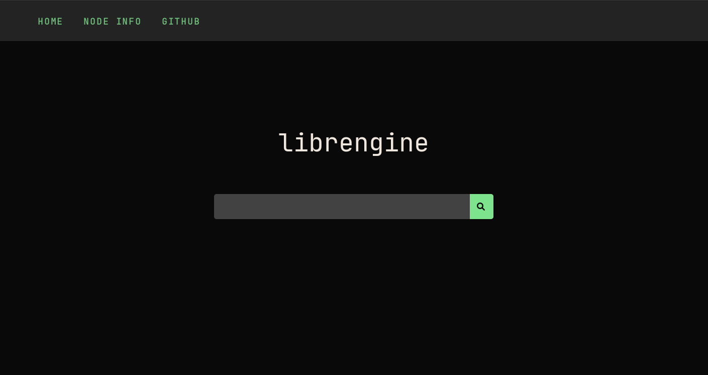

#### Privacy Web Search Engine
## Website


## Features
#### Crawler
- Threads
- Cache
- Robots.txt
- Update info after time
- Proxy
- Queue (BFS)
- Detect trackers
- Http to https
- Normalize url

#### Website / CLI
- Encryption (rsa)
- API
- Proxy
- Nodes
- Rating

## TODO
- [x] Encryption (assymetric)
- [x] Multithreading crawler
- [ ] Robots Rules (from headers & html) & crawl-delay
- [x] Responsive web design
- [ ] Own FTS ([...](https://github.com/liameno/kissearch))
- [ ] Images Crawler

## Dependencies
- libcurl   ([source](https://github.com/curl/curl))
- lexbor    ([source](https://github.com/lexbor/lexbor))
- typesense ([source](https://github.com/typesense/typesense))
- openssl   ([source](https://github.com/openssl/openssl))

```shell
cd scripts && sh install_deps.sh
```
## Build
```shell
cd scripts && sh build_all.sh
```
## Run
```shell
mkdir /tmp/typesense-data &&
./typesense-server --data-dir=/tmp/typesense-data --api-key=xyz --enable-cors &&
sh scripts/init_db.sh
```
#### Crawler
```shell
./crawler ../../sites.txt 5 ../../config.json
#[sites_path] [threads_count] [config path]
```
#### Website
```shell
./website ../../config.json
#[config path]
```
#### CLI
###### Run website before
```shell
./cli gnu 1 ../../config.json
#[query] [page] [config path]
```
## Config 
```json
//proxy: type://ip:port OR empty ("")
//socks5://127.0.0.1:9050

//_s - seconds

{
  "global": {
    //edit also website/frontend/js/search_encrypt.js
    "rsa_key_length": 1024, //1024|2048|4096
    "max_title_show_size": 55,
    "max_desc_show_size": 350,
    "nodes": [
      {
        "name": "This",
        "url": "http://127.0.0.1:8080"
      }
    ]
  },
  "crawler": {
    "user_agent": "librengine",
    "proxy": "socks5://127.0.0.1:9050",
    "load_page_timeout_s": 10,
    "update_time_site_info_s_after": 864000, //10 days
    "delay_time_s": 3, 
    "max_pages_site": 5,
    "max_page_symbols": 50000000, //50mb
    "max_robots_txt_symbols": 3000,
    "max_lru_cache_size_host": 512,
    "max_lru_cache_size_url": 512,
    "is_http_to_https": true,
    "is_check_robots_txt": true
  },
  "cli": {
    "proxy": "socks5://127.0.0.1:9050"
  },
  "website": {
    "port": 8080,
    "proxy": "socks5://127.0.0.1:9050"
  },
  //edit also init_db.sh
  "db": {
    "url": "http://localhost:8108",
    "api_key": "xyz"
  }
}

```

## License
GNU Affero General Public License v3.0